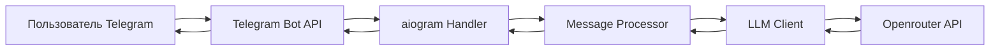

# Техническое видение проекта: Кулинарный помощник в Telegram

## Обзор проекта
Telegram-бот на основе LLM, который служит кулинарным помощником, помогая пользователям с вопросами и беседами о готовке.

## Технологии

### Основной стек
- **Python 3.11+** - основной язык разработки
- **uv** - менеджер зависимостей и виртуальных окружений
- **aiogram 3.x** - фреймворк для Telegram Bot API с polling методом
- **openai** - официальный клиент для работы с LLM через Openrouter
- **python-dotenv** - управление конфигурацией через .env файлы
- **make** - система сборки и управления задачами

### Интеграция с LLM
- **Провайдер**: Openrouter
- **Клиент**: Официальный OpenAI Python client с кастомным base_url
- **Модель**: Настраиваемая через конфигурацию
- **Подход**: Stateless взаимодействие без сохранения истории

## Принципы разработки

### KISS (Keep It Simple, Stupid)
- Минимальное количество файлов (2-3 основных файла)
- Отсутствие сложных абстракций
- Прямая логика обработки сообщений
- Нет избыточных слоев архитектуры

### YAGNI (You Aren't Gonna Need It)
- Нет базы данных (in-memory обработка)
- Нет системы аутентификации
- Нет сложной системы конфигурации
- Нет системы мониторинга и метрик на старте

### Простота как главный приоритет
- Каждая функция решает одну конкретную задачу
- Минимальные зависимости
- Понятный и читаемый код
- Быстрый старт и простая настройка

## Структура проекта

```
cooking-assistant/
├── src/
│   ├── bot.py              # Основной файл бота с aiogram
│   ├── llm_client.py       # Клиент для работы с Openrouter
│   └── config.py           # Загрузка конфигурации
├── .env                    # Конфигурационные переменные (не в git)
├── .env.example            # Пример конфигурации
├── pyproject.toml          # Конфигурация uv и зависимости
├── Makefile               # Команды для сборки и запуска
└── README.md              # Документация проекта
```

## Архитектура проекта

### Компоненты системы
1. **Telegram Bot Handler** (aiogram) - получает сообщения от пользователей
2. **LLM Client** (OpenAI client) - отправляет запросы к Openrouter API
3. **Configuration Loader** - загружает настройки из .env файла
4. **Message Processor** - связывает бота и LLM клиента

### Поток данных


## Модель данных

### Отсутствие постоянного хранилища
- **Нет базы данных** - stateless архитектура
- **Нет истории сообщений** - каждый запрос обрабатывается независимо
- **Нет пользовательских профилей** - анонимное взаимодействие

### Временные структуры
- **Сообщение пользователя** - текст запроса
- **Системный промпт** - константа, определяющая роль помощника
- **Ответ LLM** - сгенерированный текст

## Работа с LLM

### Интеграция с Openrouter
```python
# Использование OpenAI клиента с Openrouter
client = OpenAI(
    base_url="https://openrouter.ai/api/v1",
    api_key=OPENROUTER_API_KEY
)
```

### Системный промпт
```
Ты - кулинарный помощник. Твоя роль - помогать пользователям с вопросами о готовке, 
предоставлять рецепты, советы по приготовлению и общие рекомендации по кухне. 
Будь дружелюбным, знающим и полезным во всех своих ответах.
```

### Параметры генерации
- **temperature**: 0.7 (баланс креативности и предсказуемости)
- **max_tokens**: 1000 (достаточно для подробных ответов)
- **stream**: false (простая синхронная генерация)

## Сценарии работы

### Основной сценарий: Кулинарная консультация
1. Пользователь отправляет сообщение боту
2. Бот передает сообщение в LLM с системным промптом
3. LLM генерирует ответ в роли кулинарного помощника
4. Бот отправляет ответ пользователю

### Примеры использования
- "Как приготовить пасту карбонару?"
- "Чем заменить яйца в выпечке?"
- "Какие специи подходят к курице?"
- "Как правильно варить рис?"

## Подход к конфигурированию

### Переменные окружения (.env файл)
```
TELEGRAM_BOT_TOKEN=your_bot_token_here
OPENROUTER_API_KEY=your_openrouter_key_here
LLM_MODEL=anthropic/claude-3-sonnet  # или другая модель
```

### Загрузка конфигурации
- **python-dotenv** для локальной разработки
- **Прямое чтение переменных окружения** для продакшена
- **Проверка обязательных переменных** при старте

## Подход к логгированию

### Минимальное логгирование
- **Уровень**: INFO для основных событий
- **Формат**: Простой текстовый формат
- **Назначение**: Отладка и мониторинг работы

### Логируемые события
- Запуск и остановка бота
- Получение сообщений от пользователей
- Ошибки при работе с API
- Критические сбои

### Отсутствие сложной системы
- Нет ротации логов
- Нет агрегации логов
- Нет структурированного логгирования
- Простой вывод в консоль

## Принципы минимализма

### Что НЕ входит в первую версию
1. База данных и сохранение истории
2. Система аутентификации пользователей
3. Сложная система промптов
4. Многопользовательские сессии
5. Аналитика и метрики
6. Веб-интерфейс для управления
7. Система плагинов или расширений

### Критерии успеха MVP
- Бот отвечает на кулинарные вопросы
- Ответы релевантны и полезны
- Система стабильно работает
- Простая настройка и развертывание